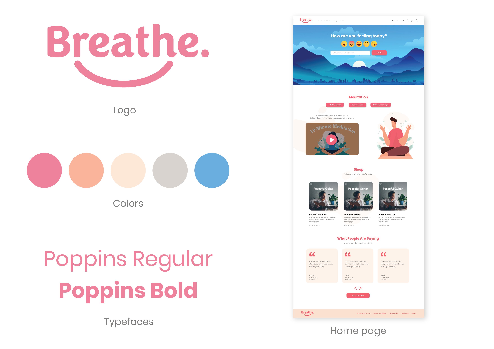
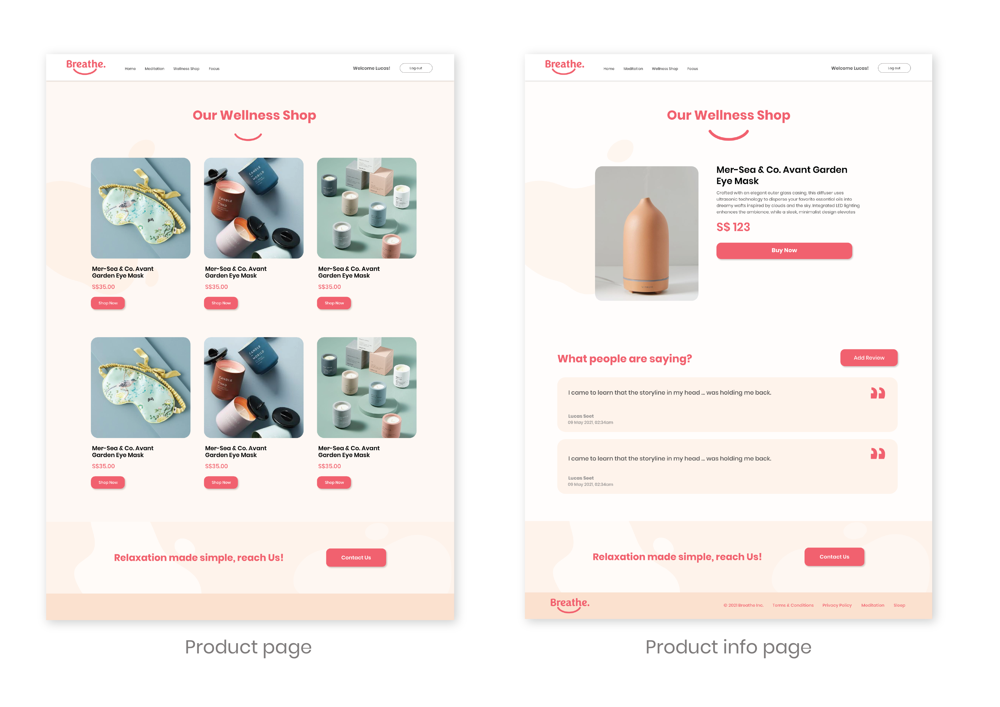

<h1>BREATHE</h1>
Link to webpage: <a href="https://breathe-meditation.herokuapp.com/">Breathe</a>

<h2>Meditation/Mindfulness Application Description</h2> 
"One year after circuit breaker, people in S'pore socialising less, working more; mental well-being has declined causing a rise instress — from straitstimes". Created an app all about mindfulness/meditation & staying focus to help combat anxiety and reduce stress level.

<h2>Application function:</h2> 
1. Meditation 
2. Stay focus (To-do list) 
3. Wellness Shop 
 

<h2>Routes / Pages</h2>

| **URL** | **HTTP Verb** |  **Action**|
|------------|-------------|------------|
| /         | GET       | index  
| /products         | GET       | index   
| /products/new         | GET       | new
| /products/:slug         | GET       | show
| /products        | POST       | create
| /products/:slug/edit        | GET       | edit
| /products/new/:slug         | PATCH       | update
| /products/:slug         | DELETE       | destroy
| /products/:slug         | POST       | create rating
| /contact       | GET      | show contact page
| /register       | GET      | show register form
| /register       | POST      | register user
| /login       | GET      | login form
| /login       | POST      | login user
| /logout       | POST      | destroy
| /focus      | GET      | show focus page
| /focus      | POST      | create to do from homepage
| /focus      | POST      | create to do from focus page
| /focus/edit/:id      | EDIT      | edit to do
| /focus/:id     | UPDATE      | update to do
| /focus/:id     | DELETE     | delete to do

 

<h2>Technologies used</h2>

Dependecies: 
- Express JS 
- Mongoose 
- NodeJS 
- HTML 
- CSS 
- MongoDB 
- MVC 
- Bcrpyt 
- Dotenv 
- Method override 
- Moment 
- Router 
- Express-flash-message 
- Express-session 

<h2>The approach Taken</h2>
1. Research 
2. Wireframe / Design mock up & logo design 
3. Started with HTML & CSS to workout the pages 
4. Set up MVC structure, 7 RESTful routes &  FULL CRUD routes. 
5. Set up database with collections in the MongoDB 
6. Linking application to heroku

<h2>Initial wireframe & design</h2>

<h2>Unsolved Problems</h2>
1. Mobile responsive 

<h2>Note to self</h2>
1. Continue working on contact page using AXIOS 

